# Analysis 1st Lab Session

## 28/10/20 - 29/10/20

### Misura diretta delle resistenze

Ho usato il multimetro _Metrix_ con le pinze 

| Resistenza |      Valore     |      F.S.     |
|:------------:|:-----------------:|:---------------:|
|     Rf     | 82.462 k&Omega; |  100 k&Omega; |
|     R1     | 8.0894 k&Omega; |   10 k&Omega; |
|     R3     |  46.54 &Omega;  |    1 k&Omega; |

Notare Rf > R1 come richiesto (circa 10 volte più grande!).

Calcolo l'amplificazione attesa: G = - Rf / R1 = -10.19383 ~ -10.2 dove il segno meno deriva dalla configurazione invertente
dell'operazionale.

### Misura dell'amplificazione

Applico ora una tensione sinusoidale di frequenza f = 1 kHz: faccio variare l'ampiezza del segnale e registro i massimi e i minimi per entrambi i
segnali Vin e Vout

#### Misure dei Massimi

| Vin |  Vout | FS Vin | FS Vout |    Tensione Generatore |
|:-------------:|:--------------:|:--------:|:------------:|:--------------:|
| 106 mV      | 997 mV       | 50 mV   | 324 mV     | 0.20 Vpp     |
| 252 mV      | 2.48 V       | 100 mV | 1.00 V     | 0.50 Vpp     |
| 400 mV      | 4.00 V       | 200 mV | 2.00 V     | 0.80 Vpp     |
| 496 mV      | 4.96 V       | 200 mV | 2.00 V     | 1.00 Vpp     |
| 744 mV      | 7.44 V       | 200 mV | 2.00 V     | 1.50 Vpp     |
| 907 mV      | 8.98 V       | 324 mV | 3.40 V     | 1.80 Vpp     |
| 1.01 V      | 9.93 V       | 324 mV | 3.40 V     | 2.00 Vpp     |
| 1.16 V      | 11.4 V       | 376 mV | 3.80 V     | 2.30 Vpp     |
| 1.29 V      | 13.0 V       | 436 mV | 4.52 V     | 2.60 Vpp     |
| 1.50 V      | 14.4 V       | 480 mV | 4.52 V     | 3.00 Vpp     |

#### Misure dei Minimi

| Vin |  Vout | FS Vin | FS Vout |    Tensione Generatore |
|:-------------:|:--------------:|:--------:|:------------:|:--------------:|
| -102 mV    | -972 mV     | 50mV   | 324 mV     |  0.20 Vpp     |
| -252 mV    | -2.48 V     | 100 mV | 1.00 V     |  0.50 Vpp     |
| -400 mV    | -3.92 V     | 200 mV | 2.00 V     |  0.80 Vpp     |
| -496 mV    | -4.96 V     | 200 mV | 2.00 V     |  1.00 Vpp     |
| -736 mV    | -7.36 V     | 200 mV | 2.00 V     |  1.50 Vpp     |
| -881 mV    | -8.98 V     | 324 mV | 3.40 V     |  1.80 Vpp     |
| -984 mV    | -10.0 V     | 324 mV | 3.40 V     |  2.00 Vpp     |
| -1.13 V    | -11.5 V     | 376 mV | 3.80 V     |  2.30 Vpp     |
| -1.29 V    | -13.0 V     | 436 mV | 4.52 V     |  2.60 Vpp     |
| -1.48 V    | -14.1 V    | 480 mV | 4.52 V     |  3.00 Vpp     |

NOTA: Impostando una tensione sul generatore pari a 3 Vpp inizia a vedersi la saturazione del segnale in uscita!

### Plots

Seguono i plot delle misure dei massimi e delle misure dei minimi, con i rispettivi grafici dei residui.

**NB gli errori devono ancora essere stimati: i plot servono per capire se l'andamento è quello che mi aspetto**

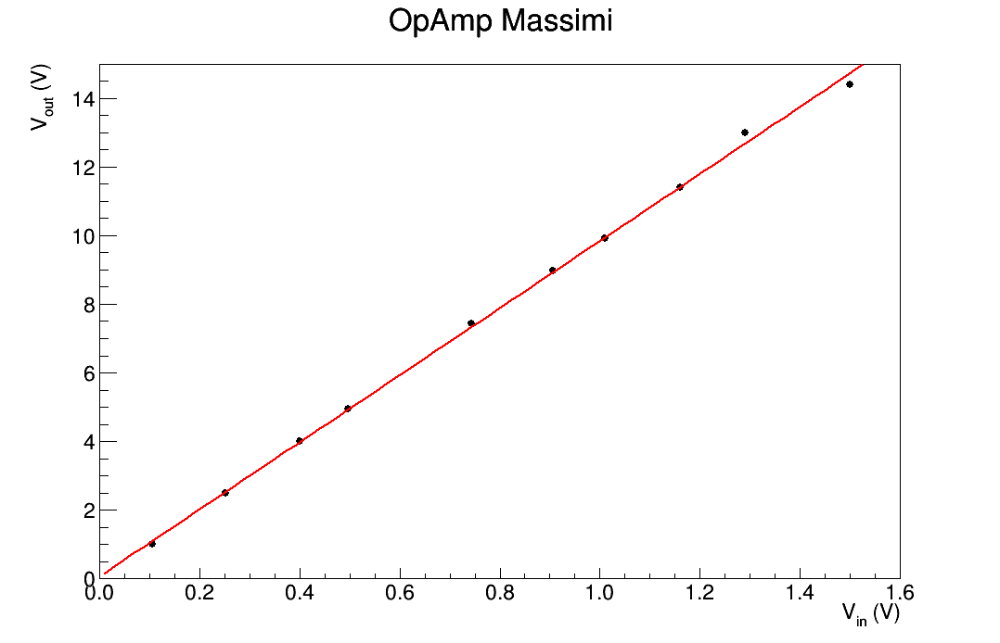

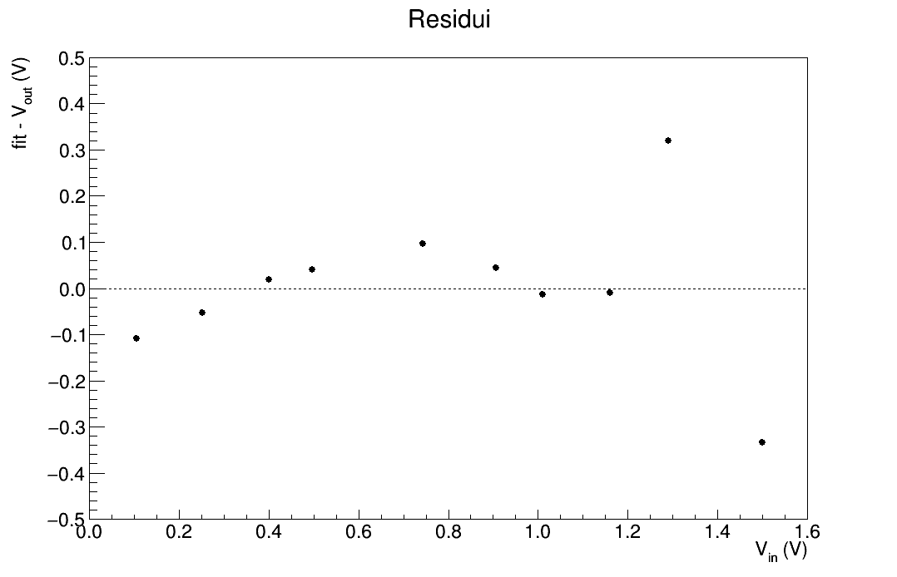

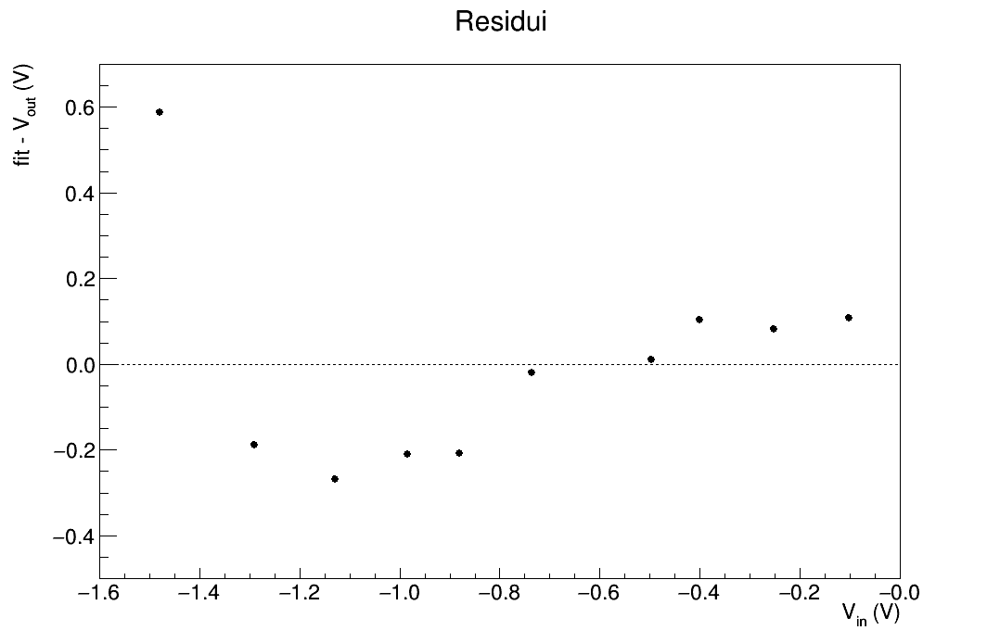

### Fit Results

**Analisi PROVVISORIA senza tenere conto delle incertezze sulle misure**

I dati inseriti nelle seguenti tabelle sono esattamente quelli restituiti da ROOT. non sono state fatte approssimazioni di alcun tipo fino ad ora.

* #### Massimi
  
| Chi2 | NDf | offset | slope |
|:----:|:----:|:----:|:----:|
|0.241668| 8 | 0.0698892   +/-   0.112246 |  9.77598   +/-   0.124436 |
 
* #### Minimi

| Chi2 | NDf | offset | slope |
|:----:|:----:|:----:|:----:|
|0.569592| 8 |  -0.0731234   +/-   0.172501 |  9.87495   +/-   0.19411  |

### Commenti

Il coefficiente angolare delle rette è leggermente più piccolo dell'amplificazione che mi aspettavo: forse rimuovendo il punto in saturazione viene
meglio! 

Dai residui si vede palesemente che il punto in saturazione non rispetta l'andamento lineare degli altri punti.

L'offset della retta è """"compatibile con lo zero"""" quindi si può pensare di effettuare un fit con un solo parametro del tipo *y = mx* per ottenere
maggiori informazioni sul coefficiente angolare.

I chi2 non sono significativi in quanto non sono stati presi in considerazioni gli errori sulle misure.

### Propagazione degli Errori

* #### Misure dirette delle Resistenze
  
  Precisione e risoluzione del multimetro Metrix3292 per i fondo-scala utilizzati nell'esperienza

  |        F.S.    | Precisione | Risoluzione |
  |:--------------:|:----------:|:-----------:|
  |1 k&Omega;      | 0.10% + 8  | 0.01 &Omega;|
  |10 k&Omega;     | 0.07% + 8  | 0.1 &Omega; |
  |100 k&Omega;    | 0.07% + 8  | 1 &Omega;   |
  
  Per stimare l'errore sulla misura diretta delle resistenze utilizzo la seguente formula:

    

  E ottengo dunque

  | Resistenza |      Valore     |      Errore    |
  |:------------:|:-----------------:|:---------------:|
  |     Rf     | 82.46 k&Omega; |  0.03  k&Omega;|
  |     R1     | 8.089 k&Omega; |  0.003 k&Omega;|
  |     R3     |  46.54 &Omega;  |  0.05  &Omega;|

* #### Stima dell'Amplificazione attesa

  Usando ora le incertezze sulle misure delle resistenze posso stimare l'errore della stima dell'amplificazione attesa. La formula di propagazione è quindi
  
   

  Si trova allora che l'amplificazione attesa è _in modulo_ **G = 10.194 +/- 0.006**.

* #### Misure con i Cursori

  Alle misure _di tensione_ acquisite con i cursori dell'oscilloscopio si associa la seguente incertezza:

  
  
  Seguono allora le misure dei massimi e dei minimi con associata l'opportuna incertezza

  * ##### Massimi
    
    | Vin  (V)  | &sigma;Vin (V)| Vout  (V) | &sigma;Vout (V)|
    |:--------:|:--------:|:---------:|:----------:|
    | 0.106 | 0.003 |  1.00 |   0.02 |
    | 0.252 | 0.006 |  2.48 |   0.05 |
    | 0.400 | 0.010 |  4.00 |   0.10 |
    | 0.496 | 0.011 |  4.96 |   0.11 |
    | 0.744 | 0.014 |  7.44 |   0.14 |
    | 0.907 | 0.019 |  8.98 |   0.19 |
    | 1.01 | 0.02 |  9.9 |   0.2 |
    | 1.16 | 0.02 | 11.4 |   0.2 |
    | 1.29 | 0.03 | 13.0 |   0.3 |
    | 1.50 | 0.03 | 14.4 |   0.3 |

  * ##### Minimi
  
    | Vin  (V)   | &sigma;Vin (V)| Vout  (V)   | &sigma;Vout (V)|
    |:--------:|:--------:|:---------:|:----------:|
    | -0.102 |  0.003 |  -0.675 |   0.016 |
    | -0.252 |  0.006 |  -2.48 |   0.05 |
    | -0.400 |  0.010 |  -3.92 |   0.10 |
    | -0.496 |  0.011 |  -4.96 |   0.11 |
    | -0.736 |  0.014 |  -7.36 |   0.14 |
    | -0.881 |  0.019 |  -8.98 |   0.19 |
    | -0.98 |  0.02 | -10.0 |   0.2 |
    | -1.13 |  0.02 | -11.5 |   0.2 |
    | -1.29 |  0.03 | -13.0 |   0.3 |
    | -1.48 |  0.03 | -14.1 |   0.3 |

### Plot con Incertezze (*DA FARE: aggiungere i dati in saturazione presi la seconda giornata*)

Noto che gli errori di Vin sono di un ordine di grandezza inferiore rispetto alle incertezze su Vout: assumo allora i primi
come trascurabili rispetto alle seconde.

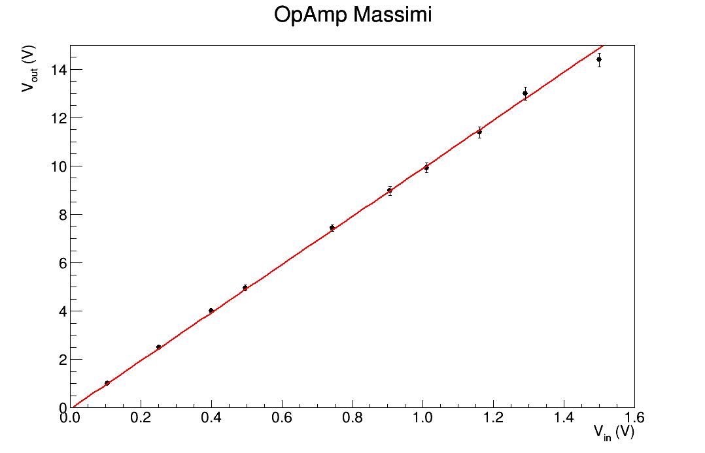

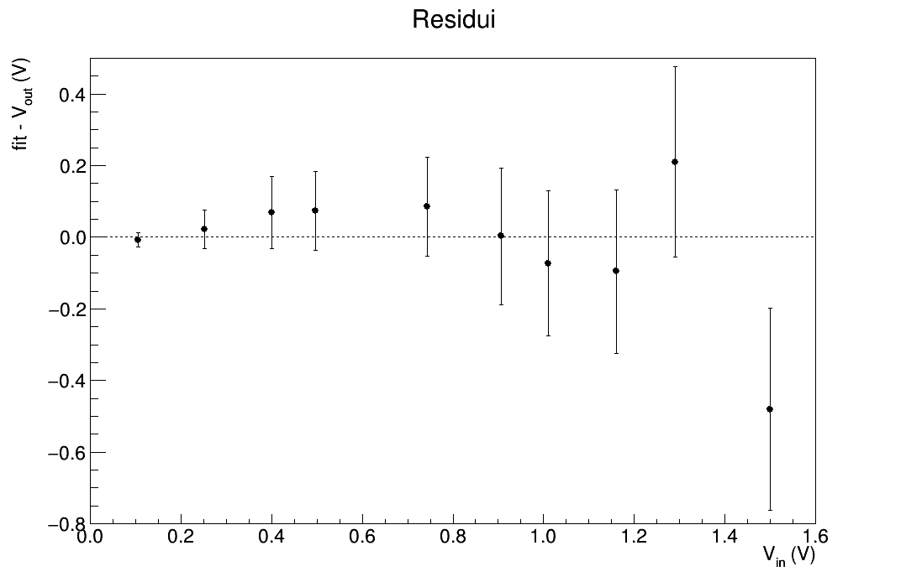

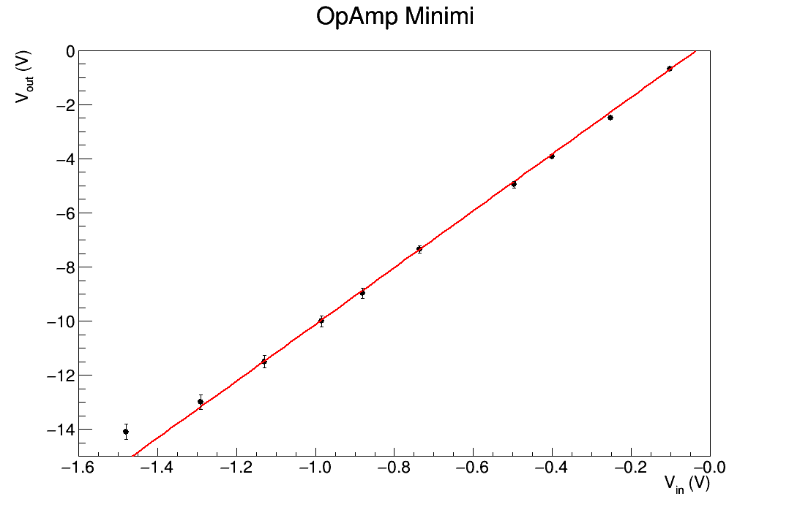

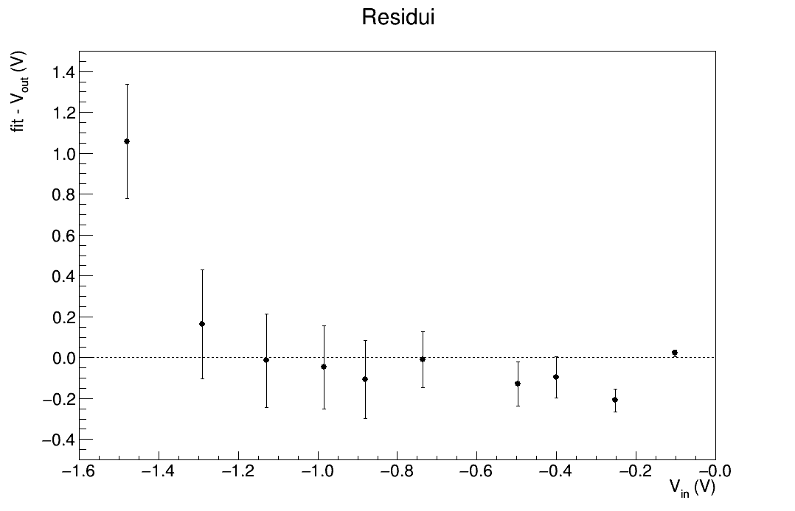

### Fit Results

I dati inseriti nelle seguenti tabelle sono esattamente quelli restituiti da ROOT &rarr; no approssimazioni.

* #### Massimi
  
| Chi2 | NDf | offset | slope |
|:----:|:----:|:----:|:----:|
|5.45772| 8 | -0.0508998   +/-   0.0235478 |  9.95416   +/-   0.0861044 |
 
* #### Minimi

| Chi2 | NDf | offset | slope |
|:----:|:----:|:----:|:----:|
|33.9391| 8 |  0.373951   +/-   0.0202559 |  10.4948   +/-   0.0852744  |

### Commenti

Aggiungendo le incertezze alle misure la situazione si chiarifica ancor di più: osservando i minimi si nota come l'ultimo punto sia un _outlier_ e va
rimosso per poter ottenere una buona stima dell'amplificazione mediante il fit. La stessa situazione si ritrova anche analizzando i massimi, tuttavia
risulta essere meno accentuata. 

### Plot senza Outliers

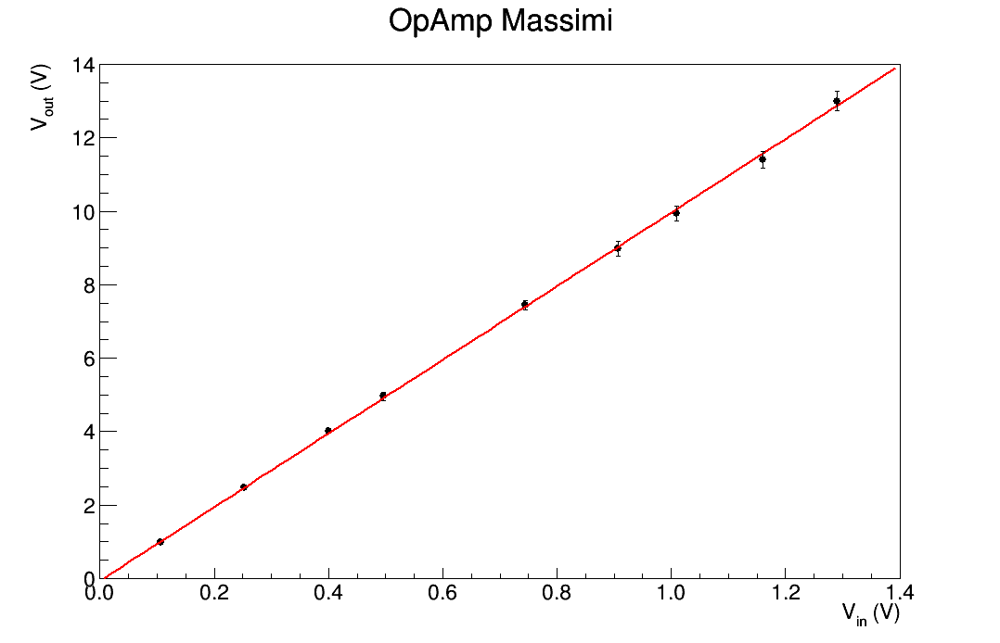

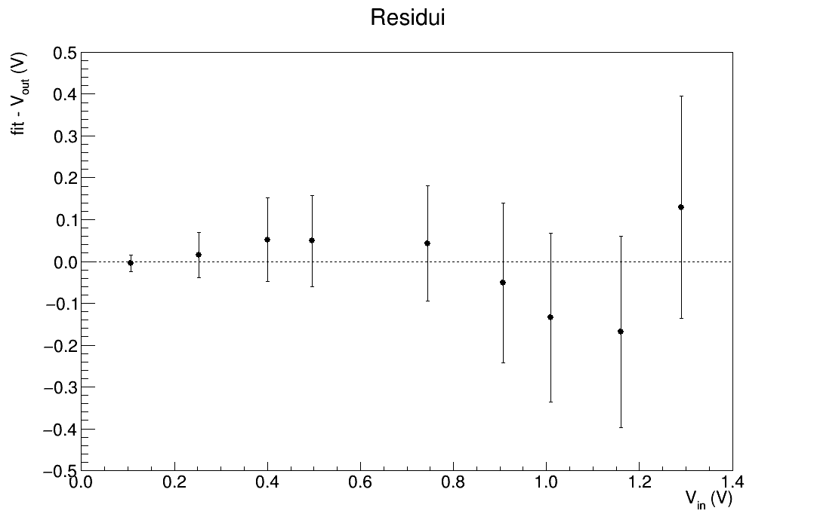

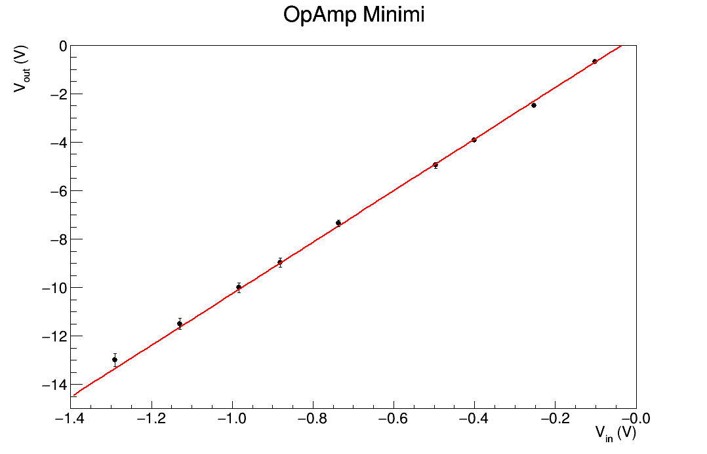

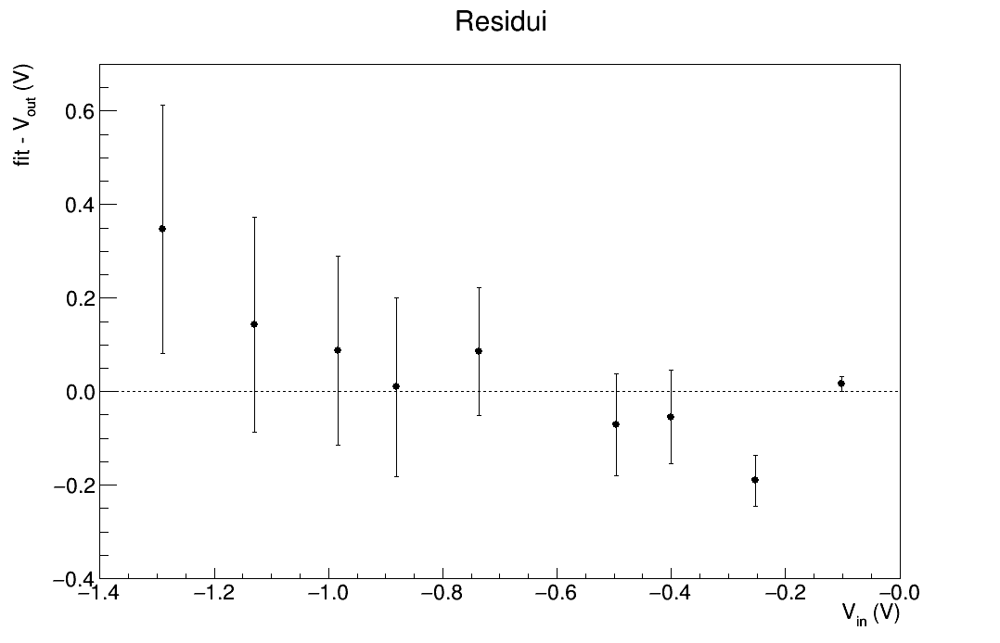

### Fit Results

I dati inseriti nelle seguenti tabelle sono esattamente quelli restituiti da ROOT &rarr; no approssimazioni.

* #### Massimi
  
| Chi2 | NDf | offset | slope |
|:----:|:----:|:----:|:----:|
|1.96966| 7 | -0.0615312   +/-   0.0242261 |  10.0251   +/-   0.0941201 |
 
* #### Minimi

| Chi2 | NDf | offset | slope |
|:----:|:----:|:----:|:----:|
|16.5686| 7 |  0.395117   +/-   0.0208828 |  10.6526   +/-   0.0933006  |

### Commenti

Purtroppo non posso dire che l'offset sia compatibile con zero: rimuovere la dipendeza da tale parametro porterebbe ad un risultato non corretto. Ora
però sorge la domanda: perchè l'offset non è compatibile con zero? 

In ogni caso, la presenza di un offset costante su tutte le misure non altera il risultato della nostra stima. Ora sorge un'altra domanda: l'offset è
costante su tutte le misure?

Se così fosse, il coefficiente angolare della retta degli ultimi fit dovrebbe restituire una buona stima dell'amplificazione del circuito! _Ricordo
che il modulo del guadagno atteso è **G = 10.194 +/- 0.006**!_

### Compatibilità

|         | Massimi | Minimi | Atteso |
|:---------:|:---------:|:--------:|:--------:|
| **Massimi** |       1 |    4.7 |    1.8 |
| **Minimi** |     4.7 |      1 |    4.9 |
| **Atteso** |     1.8 |    4.9 |      1 |

Si nota che le stime trovate sono tra loro incompatibili, ad eccezione della stima ottenuta dall'analisi dei massimi che risulta essere più o meno
compatibile con il valore atteso.

### Analisi Picco-Picco

A partire dalle misure acquisite calcolo le tensioni picco picco e l'errore corrispondente:

| Vppin (V) | &sigma;Vppin (V)| Vppout  (V)| &sigma;Vppout (V)|
|:-------:|:---------:|:-------:|:----------:|
| 0.208 |   0.004 |  1.67 |     0.03 |
| 0.504 |   0.008 |  4.96 |     0.08 |
| 0.800 |   0.014 |  7.92 |     0.14 |
| 0.992 |   0.015 |  9.92 |     0.15 |
| 1.480 |   0.019 | 14.80 |     0.19 |
| 1.788 |   0.026 | 17.96 |     0.27 |
| 1.994 |   0.028 | 19.93 |     0.29 |
| 2.290 |   0.032 | 22.90 |     0.32 |
| 2.580 |   0.037 | 26.00 |     0.38 |
| 2.980 |   0.042 | 28.50 |     0.40 |

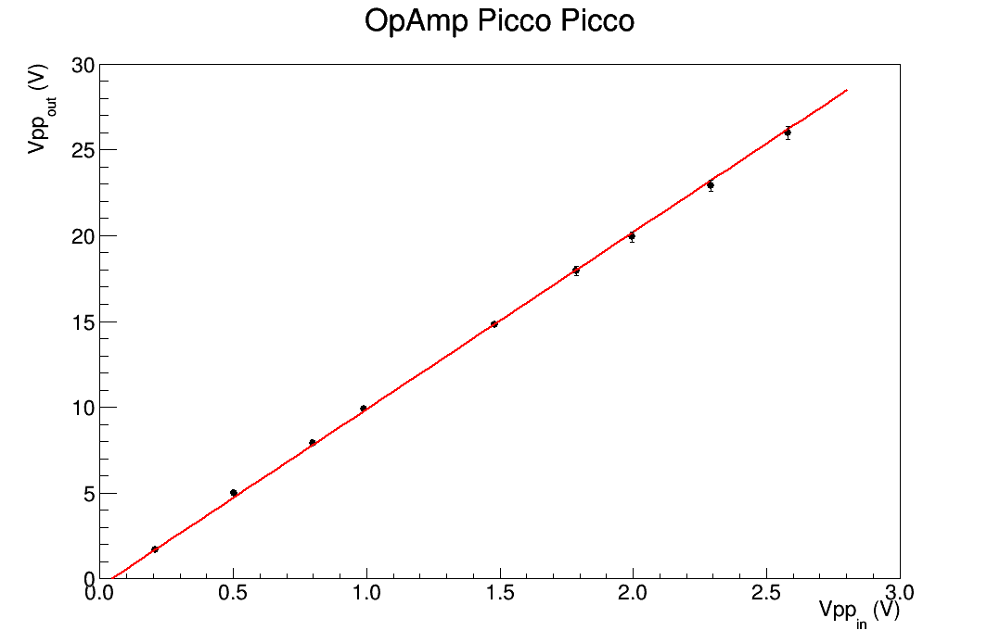

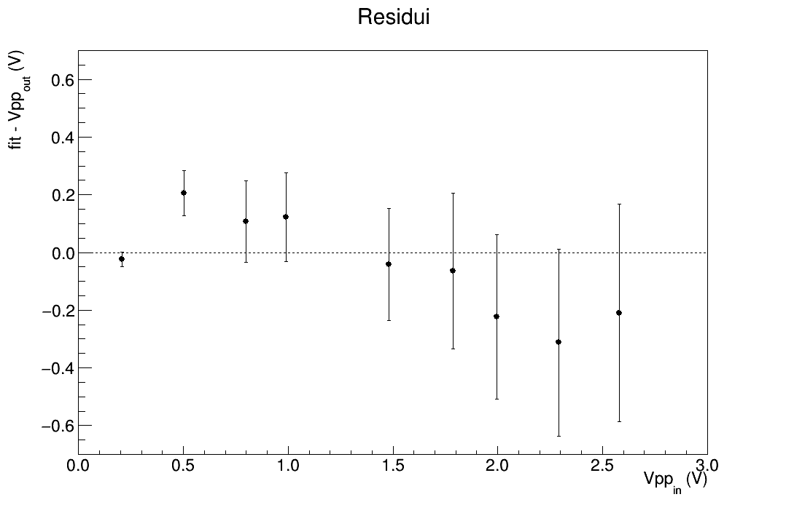

| Chi2 | NDf | offset | slope |
|:----:|:----:|:----:|:----:|
|11.0494| 7 |  -0.453955   +/-   0.0320165 |  10.3346   +/-   0.0662883  |

L'offset continua a non essere compatibile con zero. Il coefficiente angolare risulta essere leggermente compatibile con il valore atteso: si ha
infatti **&lambda; = 2.1**. Il Chi2 invece risulta essere ottimo!

I residui, tuttavia, presentano un andamento verso il basso: _**il primo punto con un errore molto piccolo pesa molto sul fit, e risulta essere un po'
fuori trend! Posso provare a ripetere il fit escludendo il primo punto!**_

### Fit Globale Massimi + Minimi

Nel fare il fit non sono stati presi in considerazione i punti in blu in quanto ritengo siano degli outlier!

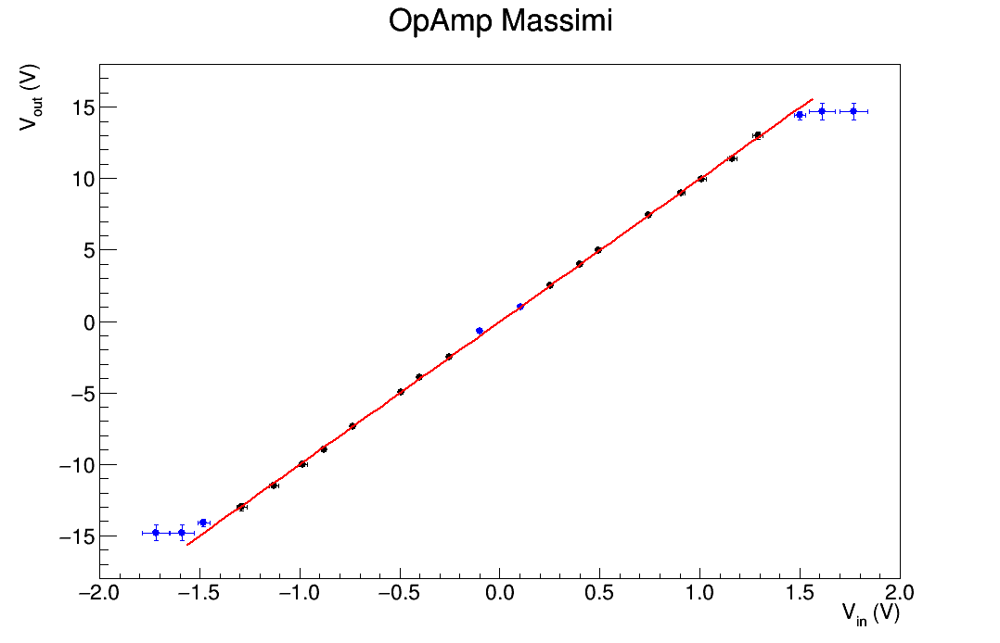

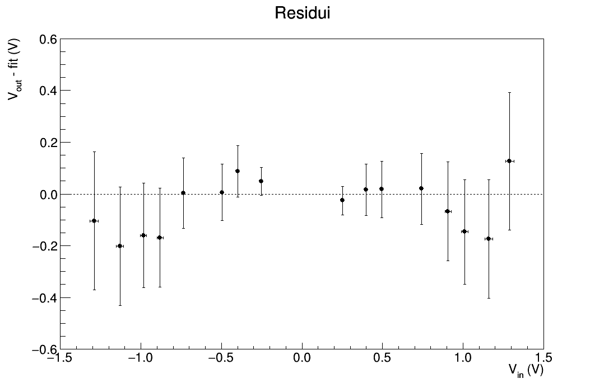

### Fit Results

I dati inseriti nelle seguenti tabelle sono esattamente quelli restituiti da ROOT &rarr; no approssimazioni.
  
| Chi2 | NDf | offset | slope |
|:----:|:----:|:----:|:----:|
|2.85112| 14 |  -0.0115109   +/-   0.0389987 |   9.98815   +/-   0.0738234 |

# Analysis 2nd Lab Session

## 29/10/20

### Misure Dirette dei Componenti

Ho usato il multimetro _Metrix_ con le pinze 

| Resistenza |      Valore     |      F.S.     |
|:------------:|:-----------------:|:---------------:|
|     Rf     | 82.462 k&Omega; |  100 k&Omega; |
|     R1     | 8.0894 k&Omega; |   10 k&Omega; |
|     R3     |  46.54 &Omega;  |    1 k&Omega; |

| Capacità |      Valore     |      F.S.     |
|:------------:|:-----------------:|:---------------:|
|     C1     | 977 pF |  1000 pF |

### Calcolo le Incertezze sulle Misure Dirette

Precisione e risoluzione del multimetro Metrix3292 per i fondo-scala utilizzati nell'esperienza

  |        F.S.    | Precisione | Risoluzione |
  |:--------------:|:----------:|:-----------:|
  |1 k&Omega;      | 0.10% + 8  | 0.01 &Omega;|
  |10 k&Omega;     | 0.07% + 8  | 0.1 &Omega; |
  |100 k&Omega;    | 0.07% + 8  | 1 &Omega;   |
  |1000 pF         | 2.5% + 15  | 1 pF   |

Ottengo dunque

  | Resistenza |      Valore     |      Errore    |
  |:------------:|:-----------------:|:---------------:|
  |     Rf     | 82.46 k&Omega; |  0.03  k&Omega;|
  |     R1     | 8.089 k&Omega; |  0.003 k&Omega;|
  |     R3     |  46.54 &Omega;  |  0.05  &Omega;|

  | Capacità |      Valore     |      Errore    |
  |:------------:|:-----------------:|:---------------:|
  |     C1     |  977 pF  | 17 pF|

### Calcolo l'Incertezza sulla Freq. di Taglio attesa

Calcolo ora la frequenza di taglio attesa come ft = &omega;t/2&pi; dove &omega;t = &omega;0 =
1/(R1 C1):

**&omega;t = 126 +/- 2 kHz**

**ft = 20.1 +/- 0.3 kHz**

### Circuito come Derivatore

Per dimostrare che il circuito si comporta come un derivatore ho impostato dal generatore un'onda triangolare di frequenza 1 kHz e ampiezza 1 V: mi
aspetto dunque in uscita un'onda quadra! 

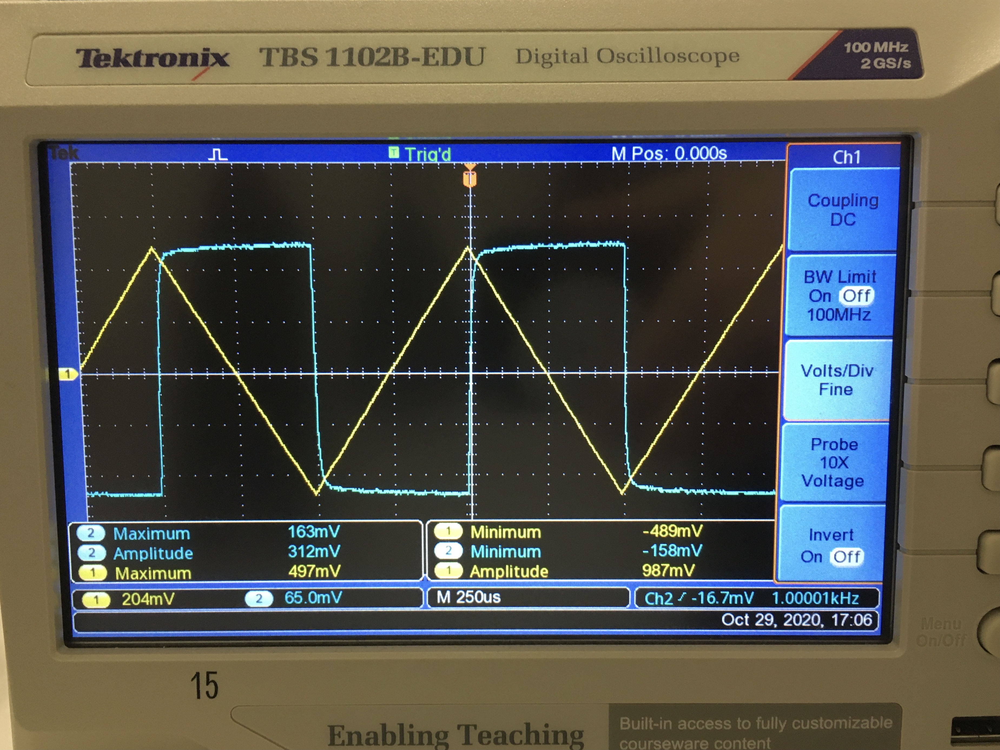

L'onda quadra non è proprio perfetta perchè la frequenza del segnale in ingresso è abbastanza alta: un derivatore lavora come filtro passa alto
(essendo reale in realtà è un passa banda) e
quindi deriva bene a basse frequenze!