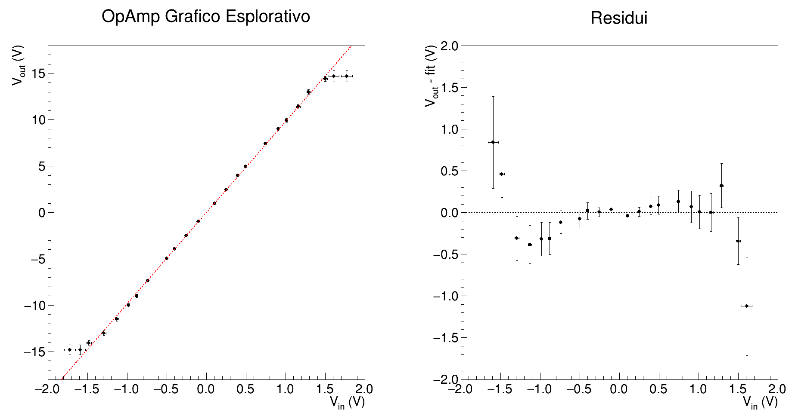

# OpAmp Data Analysis

## Misure Dirette e Amplificazione Attesa

Ho usato il multimetro _Metrix_ con le pinze 

| Resistenza |      Valore     |      F.S.     |
|:------------:|:-----------------:|:---------------:|
|     Rf     | 82.462 k&Omega; |  100 k&Omega; |
|     R1     | 8.0894 k&Omega; |   10 k&Omega; |
|     R3     |  46.54 &Omega;  |    1 k&Omega; |

Notare Rf > R1 come richiesto (circa 10 volte più grande!).

Calcolo l'amplificazione attesa: G = - Rf / R1 = -10.19383 _dove il segno meno deriva dalla configurazione invertente
dell'operazionale_.

Precisione e risoluzione del multimetro Metrix3292 per i fondo-scala utilizzati nell'esperienza

  |        F.S.    | Precisione | Risoluzione |
  |:--------------:|:----------:|:-----------:|
  |1 k&Omega;      | 0.10% + 8  | 0.01 &Omega;|
  |10 k&Omega;     | 0.07% + 8  | 0.1 &Omega; |
  |100 k&Omega;    | 0.07% + 8  | 1 &Omega;   |
  
  Per stimare l'errore sulla misura diretta delle resistenze utilizzo la seguente formula:

    

  E ottengo dunque

  | Resistenza |      Valore     |      Errore    |
  |:------------:|:-----------------:|:---------------:|
  |     Rf     | 82.46 k&Omega; |  0.03  k&Omega;|
  |     R1     | 8.089 k&Omega; |  0.003 k&Omega;|
  |     R3     |  46.54 &Omega;  |  0.05  &Omega;|

  Usando ora le incertezze sulle misure delle resistenze posso stimare l'errore della stima dell'amplificazione attesa. La formula di propagazione è quindi
  
   

  Si trova allora che l'amplificazione attesa è _in modulo_ **G = 10.194 +/- 0.006**.

## Misure con Oscilloscopio

Applico  una tensione sinusoidale di frequenza f = 1 kHz: faccio variare l'ampiezza del segnale e registro i massimi e i minimi per entrambi i
segnali Vin e Vout

### Misure dei Massimi

| Vin |  Vout | FS Vin | FS Vout |    Tensione Generatore |
|:-------------:|:--------------:|:--------:|:------------:|:--------------:|
| 106 mV      | 997 mV       | 50 mV   | 324 mV     | 0.20 Vpp     |
| 252 mV      | 2.48 V       | 100 mV | 1.00 V     | 0.50 Vpp     |
| 400 mV      | 4.00 V       | 200 mV | 2.00 V     | 0.80 Vpp     |
| 496 mV      | 4.96 V       | 200 mV | 2.00 V     | 1.00 Vpp     |
| 744 mV      | 7.44 V       | 200 mV | 2.00 V     | 1.50 Vpp     |
| 907 mV      | 8.98 V       | 324 mV | 3.40 V     | 1.80 Vpp     |
| 1.01 V      | 9.93 V       | 324 mV | 3.40 V     | 2.00 Vpp     |
| 1.16 V      | 11.4 V       | 376 mV | 3.80 V     | 2.30 Vpp     |
| 1.29 V      | 13.0 V       | 436 mV | 4.52 V     | 2.60 Vpp     |
| 1.50 V      | 14.4 V       | 480 mV | 4.52 V     | 3.00 Vpp     |
| 1.61 V      | 14.7 V       | 630 mV | 5.60 V     | 3.20 Vpp     |
| 1.77 V      | 14.7 V       | 660 mV | 5.60 V     | 3.50 Vpp     |

### Misure dei Minimi

| Vin |  Vout | FS Vin | FS Vout |    Tensione Generatore |
|:-------------:|:--------------:|:--------:|:------------:|:--------------:|
| -102 mV    | -972 mV     | 50mV   | 324 mV     |  0.20 Vpp     |
| -252 mV    | -2.48 V     | 100 mV | 1.00 V     |  0.50 Vpp     |
| -400 mV    | -3.92 V     | 200 mV | 2.00 V     |  0.80 Vpp     |
| -496 mV    | -4.96 V     | 200 mV | 2.00 V     |  1.00 Vpp     |
| -736 mV    | -7.36 V     | 200 mV | 2.00 V     |  1.50 Vpp     |
| -881 mV    | -8.98 V     | 324 mV | 3.40 V     |  1.80 Vpp     |
| -984 mV    | -10.0 V     | 324 mV | 3.40 V     |  2.00 Vpp     |
| -1.13 V    | -11.5 V     | 376 mV | 3.80 V     |  2.30 Vpp     |
| -1.29 V    | -13.0 V     | 436 mV | 4.52 V     |  2.60 Vpp     |
| -1.48 V    | -14.1 V    | 480 mV  | 4.52 V     |  3.00 Vpp     |
| -1.59 V    | -14.8 V    | 630 mV  | 5.60 V     |  3.20 Vpp     |
| -1.72 V    | -14.8 V    | 660 mV  | 5.60 V     |  3.50 Vpp     |

**Impostando una tensione sul generatore pari a 3 Vpp inizia a vedersi la saturazione del segnale in uscita!**

Alle misure di tensione acquisite con i cursori dell'oscilloscopio si associa la seguente incertezza:

  
Seguono allora le misure dei massimi e dei minimi con associata l'opportuna incertezza.

### Propagazione dei Massimi
    
| Vin  (V)  | &sigma;Vin (V)|Vout  (V) | &sigma;Vout (V)|
|:--------:|:--------:|:---------:|:----------:|
| 0.106 | 0.003 |  1.00 |   0.02 |
| 0.252 | 0.006 |  2.48 |   0.05 |
| 0.400 | 0.010 |  4.00 |   0.10 |
| 0.496 | 0.011 |  4.96 |   0.11 |
| 0.744 | 0.014 |  7.44 |   0.14 |
| 0.907 | 0.019 |  8.98 |   0.19 |
| 1.01 | 0.02 |  9.9 |   0.2 |
| 1.16 | 0.02 | 11.4 |   0.2 |
| 1.29 | 0.03 | 13.0 |   0.3 |
| 1.50 | 0.03 | 14.4 |   0.3 |
| 1.61 | 0.03 | 14.7 | 0.3 |
| 1.77 | 0.04 | 14.7 | 0.3 |

### Propagazione dei Minimi
  
| Vin  (V)   | &sigma;Vin (V)| Vout  (V)   | &sigma;Vout (V)|
|:--------:|:--------:|:---------:|:----------:|
| -0.102 |  0.003 |  -0.675 |   0.016 |
| -0.252 |  0.006 |  -2.48 |   0.05 |
| -0.400 |  0.010 |  -3.92 |   0.10 |
| -0.496 |  0.011 |  -4.96 |   0.11 |
| -0.736 |  0.014 |  -7.36 |   0.14 |
| -0.881 |  0.019 |  -8.98 |   0.19 |
| -0.98 |  0.02 | -10.0 |   0.2 |
| -1.13 |  0.02 | -11.5 |   0.2 |
| -1.29 |  0.03 | -13.0 |   0.3 |
| -1.48 |  0.03 | -14.1 |   0.3 |
| -1.59 | 0.03 | -14.8 | 0.3 |
| -1.72 | 0.04 | -14.8 | 0.3 |

### Fit Preliminari

Ora faccio due fit separati per massimi e minimi considerando solo gli errori su Vout al fine di stimare il coefficiente angolare _m_
(_slope_). Questo lo userò poi per proiettare gli errori di Vin lungo l'asse y: in tal modo potrò sommare quadraticamente i contributi
d'errore di Vout e Vin.

**NB: I fit vengono effettuati senza gli outliers, ovvero gli ultimi tre dati presi in saturazione!**

Mostriamo prima di tutto la presenza degli outliers: faccio un plot espolaritvo con tutti i dati, sia massimi sia minimi, con il loro errore sia lungo
x sia lungo y, ed effettuo un fit per osservare l'andamento dei residui.

Si nota chiaramente come gli ultimi tre punti nelle code non rispettino il trend lineare: sono proprio i punti presi in saturazione, che quindi non
verranno considerati nell'analisi successiva.

#### Fit Massimi

| Chi2 | NDf | offset | slope |
|:----:|:----:|:----:|:----:|
| 1.96966 | 7 |-0.0615312   +/-   0.0242261|   10.0251   +/-   0.0941201 |

#### Fit Minimi

| Chi2 | NDf | offset | slope |
|:----:|:----:|:----:|:----:|
| 1.35854 | 7 |0.0675817   +/-   0.0238213|   10.157   +/-   0.0948987 |

### Proiezione Errori

Ora che ho effettuato i fit preliminari, utilizzo il coefficiente angolare della retta interpolante per proiettare gli errori di Vin su Vout.