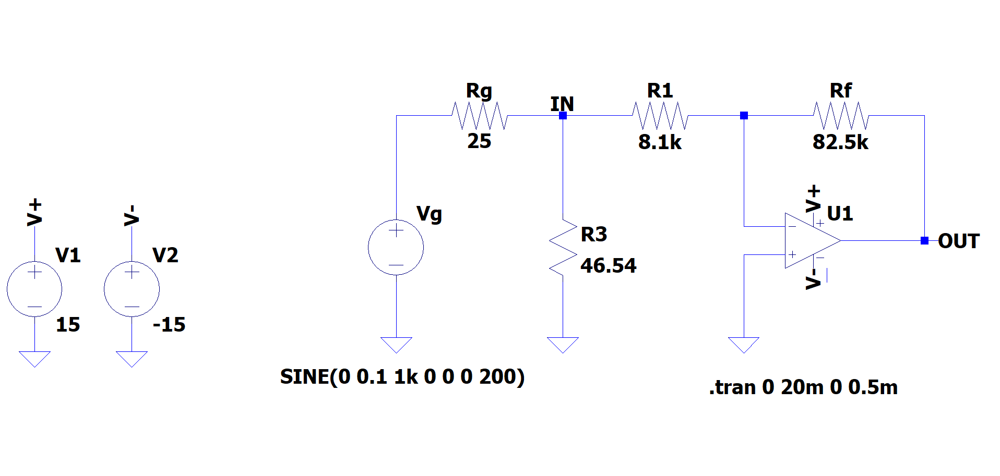
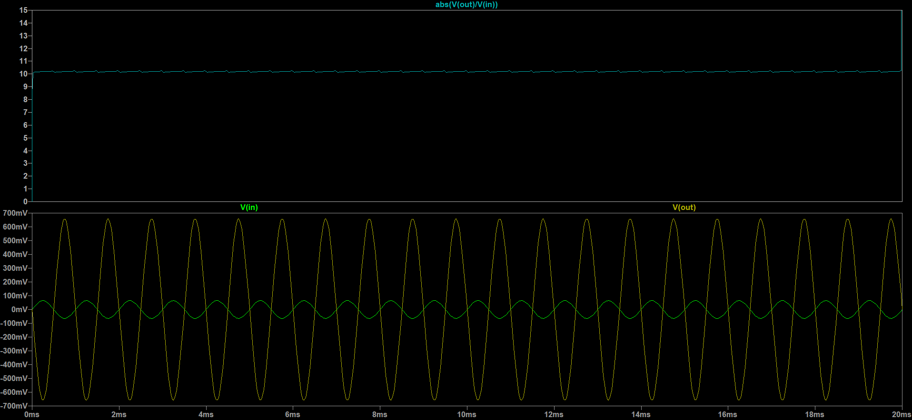
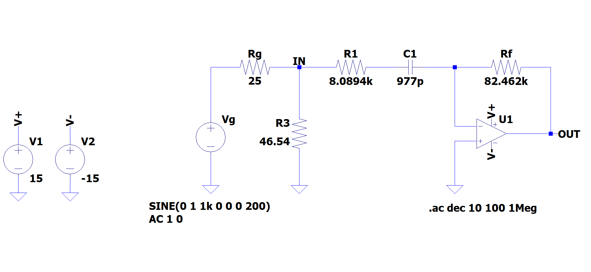

# Planning 1st Lab Session

## 28/10/20 - 29/10/20

### Materiale e Strumentazione

* Circuito integrato TL082C &rarr; 2 amplificatori operazionali
* Resistenze e condensatori
* Alimentatore di tensione continua stabilizzato con 2 uscite tra 0 e 20 V e una fissa a 5 V
* Generatore di funzioni Tektronix AFG 1022
* Oscilloscopio digitale Tektronix TBS 1102B
* Multimetro digitale Metrix e Agilent
* Scheda Arduino Due

  **NB: USARE LE SONDE**

### Alimentazione dell'Operazionale

Collego l'operazionale alle alimentazioni

* Vcc = +15 V
* Vee = -15 V

Collego due capacità da C = 0.1 $\mu$F tra le alimentazioni degli operazionali e la massa (però vicine all'operazionale!).

### 1) Funzione di Trasferimento per un amplificatore INVERTENTE

* Misuro con il multimetro le resistenze in dotazione, usando Rf > R1!
  
* Assemblo il seguente circuito

* La risposta che mi aspetto è 

* L'amplificazione attesa _ideale_ è $R_f / R_1 = 10$

* Sul generatore imposto l'impedenza di 50 $\Omega$ in modo da leggere sul display un valore compatibile con quello misurato dall'oscilloscopio

* Applico una **tensione sinusoidale** di **frequenza 1 kHz** e un'**ampiezza di 0.2 Vpp** 

* Misuro la tensione in ingresso **Vin** e in uscita **Vout** come in figura utilizzando i due canali dell'oscilloscopio

* **Aumento progressivamente l'ampiezza del segnale in ingresso e misuro l'ampiezza in uscita fino a prendere un paio di punti in saturazione!**

* Registro separatamente massimi e minimi sia per Vin sia per Vout **usando i cursori**

* Mostro in grafico Vout vs Vin (sia per i massimi che per i minimi)
  * Mi aspetto una retta passante per l'origine (in assenza di errori sistematici) con coefficiente angolare pari all'amplificazione (~10 in modulo)

### 2) Circuito Derivatore

* Modifico il circuito precedente aggiungendo una capacità

* Misuro la capacità con il multimetro

* Assemblo il seguente circuito

* Inietto un'**onda triangolare** di **ampiezza 1 V** e **frequenza 1 kHz** per verificare che stia derivando il segnale: faccio una foto!

* Frequenza di taglio attesa: $f_t$ = $\omega_f/2\pi$ dove $\omega_f$ è quel valore tale che l'amplificazione massima è ridotta di un fattore $\sqrt{2}$
  
* Massimo guardagno atteso: Rf / R1 = 10 (?)

* Inietto un'**onda sinusoidale** &rarr; ricavo sperimentalmente la **frequenza di taglio** modificando la frequenza del generatore fino a raggiungere
  l'amplificazione attessa per la frequenza di taglio (?)

* Misuro la risposta in frequenza (solo ampiezze, no fase) con una decina di punti tra **100 Hz** e **1 MHz**

* Riporto in grafico l'andamento dell'amplificazione usando _scale logaritmiche_ 

