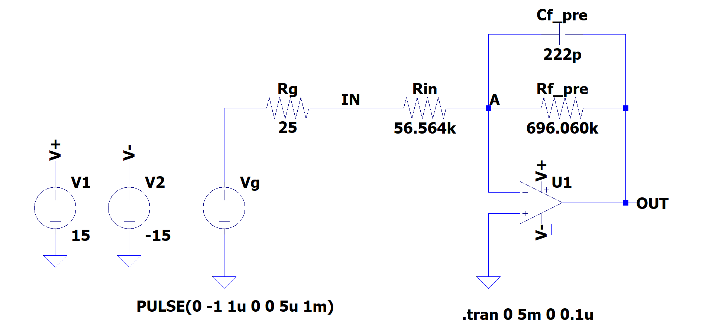

# Lab Session 23/11/2020

## Planning of the 1st Day

### PRE-AMPLIFICATORE

Assembo il circuito in figura

* Imposto sul CH1 del generatore un **impulso** quadrato.
  * Frequenza 1kHz
  * Durata T = 5&mu;s
  * Vlow = 0V
  * Vhigh = -1V _negativo_ (molto importante)

* SCELGO Rin TRA 45k&Omega; E 85k&Omega;
  * Calcolo Qin = T * V / Rin
* SCELGO Cf, pre TRA 160pF E 350pF
* SCELGO Rf, pre TRA 500k&Omega; E 1000k&Omega;
  * Calcolo il tempo caratteristico &tau;pre = Rf, pre  * Cf, pre atteso
  * Calcolo il valore di tensione massimo VpreMAX = Qin / Cf, pre = ( T * V
    ) / ( Rin * Cf, pre ) atteso

Il circuito è un integratore invertente: impostando sul generatore una tensione negativa ottengo in output un segnale
positivo _acquisibile direttamente con Arduino_.

* Simulazione della risposta del circuito raffigurato sopra al segnale impulso negativo:

* Verifico con l'oscilloscopio l'effetto di integrazione della carica e il successivo smorzamento esponenziale. 
* Confronto il valore massimo di tensione atteso con quello misurato.

#### Verifica Linearità

Misuro la tensione massima in uscita al variare della durata dell'impulso in ingresso, cioè al variare della carica
iniettata. Eseguo alcune misure partendo da T = 2&mu;s fino a T = 10&mu;s circa.

Contruisco il grafico VpreMAX vs Qin e fitto con una retta per vedere se è lineare.

#### Tempo Caratteristico

Analizzo la fase di scarica del segnale: imposto T = 5&mu;s e acquisisco la forma d'onda con Arduino. Stimo
approssimativamente il lab il tempo caratteristico per vedere che sia ragionevole &rarr; come? Tempo di dimezzamento per
qualche tipo di logaritmo o radice di due? 

#### Risposta in Frequenza (molto importante)

Faccio variare la frequenza tra 10Hz e 1MHz e costruisco il grafico di Bode. Verificare il comportamento da circuito
integratore e filtro passa basso.

Confronto i risultati con la simulazione Spice

