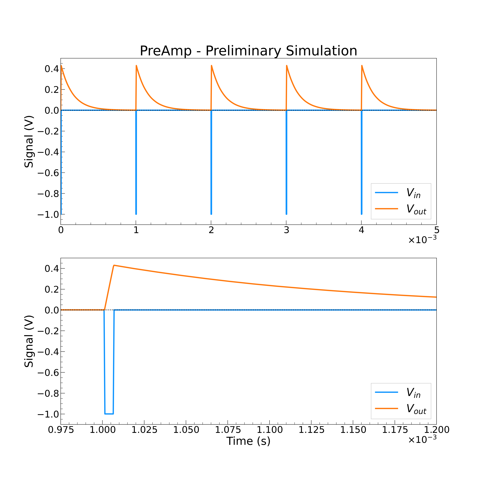

# Lab Session 23/11/2020

## Planning of the 1st Day

### PRE-AMPLIFICATORE

Assembo il circuito in figura

* Imposto sul CH1 del generatore un **impulso** quadrato.
  * Frequenza 1kHz
  * Durata T = 5&mu;s
  * Vlow = 0V
  * Vhigh = -1V _negativo_ (molto importante)

* SCELGO Rin TRA 45k&Omega; E 85k&Omega;
  * Calcolo Qin = T * V / Rin
* SCELGO Cf, pre TRA 160pF E 350pF
* SCELGO Rf, pre TRA 500k&Omega; E 1000k&Omega;
  * Calcolo il tempo caratteristico &tau;pre = Rf, pre  * Cf, pre atteso
  * Calcolo il valore di tensione massimo VpreMAX = Qin / Cf, pre = ( T * V
    ) / ( Rin * Cf, pre ) atteso

Il circuito è un integratore invertente: impostando sul generatore una tensione negativa ottengo in output un segnale
positivo _acquisibile direttamente con Arduino_.

* Simulazione della risposta del circuito raffigurato sopra al segnale impulso negativo:

* Verifico con l'oscilloscopio l'effetto di integrazione della carica e il successivo smorzamento esponenziale. 
* Confronto il valore massimo di tensione atteso con quello misurato.

#### Verifica Linearità

Misuro la tensione massima in uscita al variare della durata dell'impulso in ingresso, cioè al variare della carica
iniettata. Eseguo alcune misure partendo da T = 2&mu;s fino a T = 10&mu;s circa.

Contruisco il grafico VpreMAX vs Qin e fitto con una retta per vedere se è lineare.

#### Tempo Caratteristico

Analizzo la fase di scarica del segnale: imposto T = 5&mu;s e acquisisco la forma d'onda con Arduino. Stimo
approssimativamente il lab il tempo caratteristico per vedere che sia ragionevole &rarr; metto il cursore due a livello
asintotico di smorzamento, misuro il massimo e faccio VpreMAX / e &rarr; metto il cursore 1 a
livello V(&tau;) e guardo dove interseca la traccia del segnale &rarr; il tempo t segnato da M Pos in alto a destra è &tau;

#### Risposta in Frequenza (molto importante)

Faccio variare la frequenza tra 10Hz e 1MHz e costruisco il grafico di Bode. Verificare il comportamento da circuito
integratore e filtro passa basso.

Confronto i risultati con la simulazione Spice

# Lab Session 25/11/2020

## Planning of the 2nd Day

### SHAPER CR-RC

Assemblo il circuito in figura

* Imposto sul CH1 del generatore un'onda quadra.
  * Frequenza 100Hz
  * Vlow = 0V
  * Vhigh = 1V 

* SCELGO R1sh = R2sh TRA 90k&Omega; E 160k&Omega;
* SCELGO C1sh = C2sh TRA 90pF E 160pF

* Calcolo il tempo caratteristico &tau;sh = R1shC1sh = R2shC2sh

* **EFFETTUO LE SEGUENTI MISURE**
  * Valore del massimo VshMAX _CHE DEVE ESSERE Vin / e_
  * Tempo in cui viene assunto il massimo tshMAX _CHE DEVE ESSERE PROPRIO &tau;sh_

* Registro ora una forma d'onda con Arduino

* Studio la risposta in frequenza da 10Hz a 1MHz

#### ATTACCO IL PREAMPLIFICATORE IN INGRESSO ALLO SHAPER

Devo ripristinare le condizioni del PreAmp per verificare che funzioni: IMPULSO QUADRATO T = 5us f = 1kHz Vlow = 0V
Vhigh = -1V

* Prendo nota della tensione massima VpreMAX in uscita dal preamplificatore
* Misuro il massimo VshMAX del segnale in uscita, il tempo in cui viene raggiunto e il massimo di undershoot
* Calcolo il valore di Rpz per compensare l'effetto &rarr; Rpz = &tau;pre / C1sh
  * Ricordo che, teoricamente, &tau;pre = 161.486 +/- 6.493 &mu;s

Posso ora prendere Arduino sia senza sia con Rpz e ho finito per oggi.

# Lab Session 26/11/2020

## Planning of the 3rd Day

### CATENA COMPLETA

Assemblo un semplicissimo amplificatore non invertente per amplificare il segnale che esce dallo shaper. 

* Imposto sul generatore un impulso quadrato di durata T = 10 &mu;s con la solita ampiezza negativa
* Misuro il massimo del segnale in uscita dallo shaper
* Calcolo quanta amplificazione mi serve per avere 2V
* Uso le resistenze per ottenere tale amplificazione

#### Linearità della Catena Elettronica
Acquisisco con Arduino le forme d'onda al variare di T da 2&mu;s a 10&mu;s

* Prendo Vmax per ogni forma d'onda e costruisco il plot Vmax vs Qin come nel caso PreAmp
  
#### Risposta in Frequenza &rarr; THEBODE

#### EFfetto dello Shaping Time

Cambio le resistenza di shaping Rsh1 e Rsh2 con una coppia di valore ridotto in modo da modificare &tau;sh senza però
influenzare la compensazione di pole-zero.

* Acquisisco la forma d'onda con Arduino
  