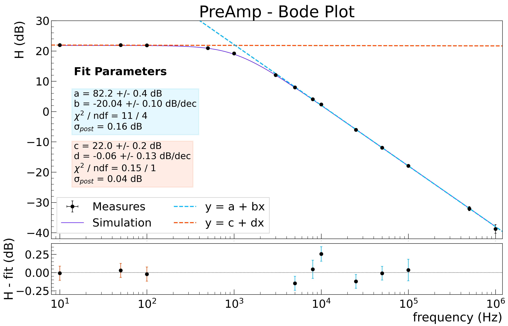

# ESPERIENZA: CATENA ELETTRONICA

## FASE DI ANALISI DATI 

### Preamplificatore  &rarr; analisi ( _quasi_ ) completata

[JUPYTER
NOTEBOOK](https://nbviewer.jupyter.org/github/niklai99/physics_laboratory_2020_2021/blob/master/CATENA%20ELETTRONICA/Python/PreAmp%20-%20Analysis.ipynb)
: nel notebook è riportata passo passo l'analisi dati riguardante il preamplificatore. In particolare:

* Verifica accordo tra misure sperimentali e stime teoriche
* Verifica della linearità del preamplificatore
  
    

* Stima della capacità di feedback 
* Stima del tempo caratteristico dello smorzamento esponenziale

    

* Analisi in frequenza e stima della frequenza di taglio
  
    

**NOTA BENE:** L'analisi della forma d'onda acquisita con Arduino è riportata
[qui](https://nbviewer.jupyter.org/github/niklai99/physics_laboratory_2020_2021/blob/master/CATENA%20ELETTRONICA/Python/Arduino%20-%20Noise%20Reduction.ipynb)!
Sono riportati anche alcuni tentativi di riduzione del rumore di fondo, ma l'analisi ancora non è conclusa. Una media
mobile sembra essere la soluzione più facile dal punto di vista della propagazione degli errori!

### Shaper CR-RC  &rarr; analisi incompleta

[JUPYTER
NOTEBOOK](https://nbviewer.jupyter.org/github/niklai99/physics_laboratory_2020_2021/blob/master/CATENA%20ELETTRONICA/Python/Shaper%20-%20Analysis.ipynb):
il notebook viene aggiornato _molto_ spesso :smile:

### Catena Completa  &rarr; analisi assente

Prossimamente su questi schermi :heart:

