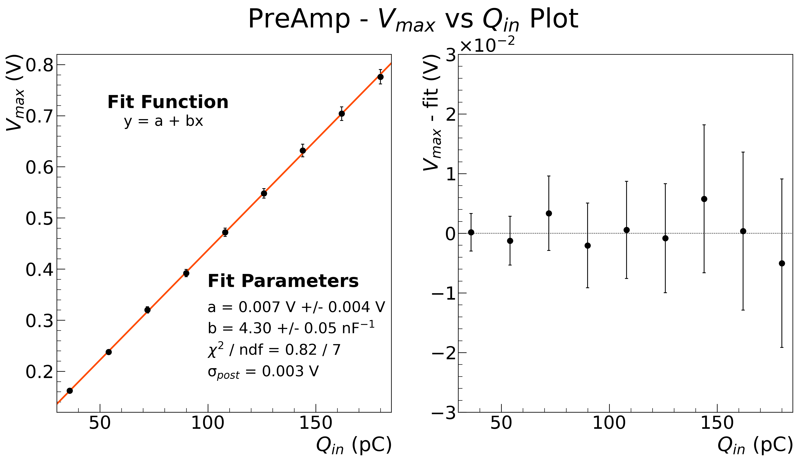
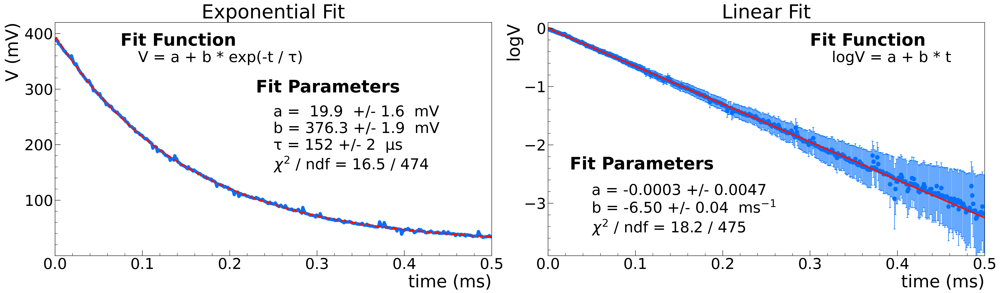
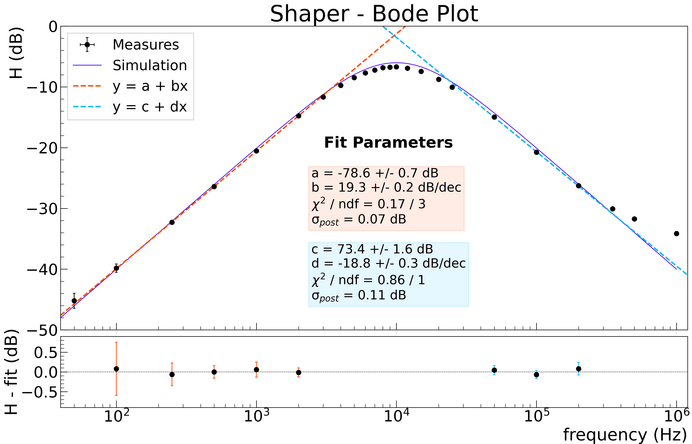

# ESPERIENZA: CATENA ELETTRONICA

***

## STESURA DELLA RELAZIONE (in corso)

Il file PDF della relazione si trova [QUI](https://nbviewer.jupyter.org/github/niklai99/physics_laboratory_2020_2021/blob/master/CATENA%20ELETTRONICA/Report/Report.pdf)!

### Preamplificatore  &rarr; dovrebbe essere finito

### Shaper  &rarr; dovrebbe essere finito

### Catena Completa  &rarr; manca linearità e bode

## FASE DI ANALISI DATI (completata)

### Preamplificatore  &rarr; analisi completata

[JUPYTER
NOTEBOOK](https://nbviewer.jupyter.org/github/niklai99/physics_laboratory_2020_2021/blob/master/CATENA%20ELETTRONICA/Python/PreAmp%20-%20Analysis.ipynb)
: nel notebook è riportata passo passo l'analisi dati riguardante il preamplificatore. In particolare:

* Verifica accordo tra misure sperimentali e stime teoriche
* Verifica della linearità del preamplificatore
  
    

* Stima della capacità di feedback 
* Stima del tempo caratteristico dello smorzamento esponenziale

    

* Analisi in frequenza e stima della frequenza di taglio
  
    

**NOTA BENE:** L'analisi della forma d'onda acquisita con Arduino è riportata
[qui](https://nbviewer.jupyter.org/github/niklai99/physics_laboratory_2020_2021/blob/master/CATENA%20ELETTRONICA/Python/Arduino%20Test/Arduino%20Test%202.ipynb)!

### Shaper CR-RC  &rarr; analisi completata

[JUPYTER
NOTEBOOK](https://nbviewer.jupyter.org/github/niklai99/physics_laboratory_2020_2021/blob/master/CATENA%20ELETTRONICA/Python/Shaper%20-%20Analysis.ipynb):
: nel notebook è riportata passo passo l'analisi dati riguardante il preamplificatore. In particolare:

* Verifica accordo tra misure sperimentali e stime teoriche
* Analisi in frequenza e stima della frequenza di taglio
  
    

* Studio delle forme d'onda acquisite con Arduino dello Shaper collegato a
  * Generatore = preamplificatore ideale
        
  * Preamplificatore
        
  * Preamplificatore con compensazione di _pole-zero_
        

### Catena Completa  &rarr; analisi completata

[JUPYTER
NOTEBOOK](https://nbviewer.jupyter.org/github/niklai99/physics_laboratory_2020_2021/blob/master/CATENA%20ELETTRONICA/Python/PreAmp%20-%20Analysis.ipynb)
: nel notebook è riportata passo passo l'analisi dati riguardante la catena elettronica completa.  In particolare 

* Verifica accordo tra misure sperimentali e stime teoriche
* Verifica della linearità della catena 
* Analisi in frequenza e stima della frequenza di taglio
  
    
